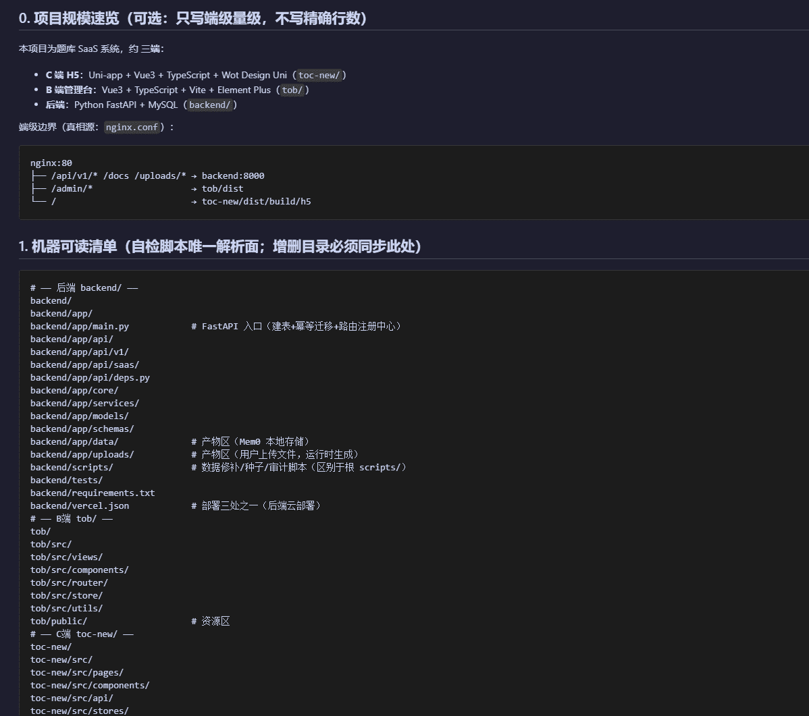
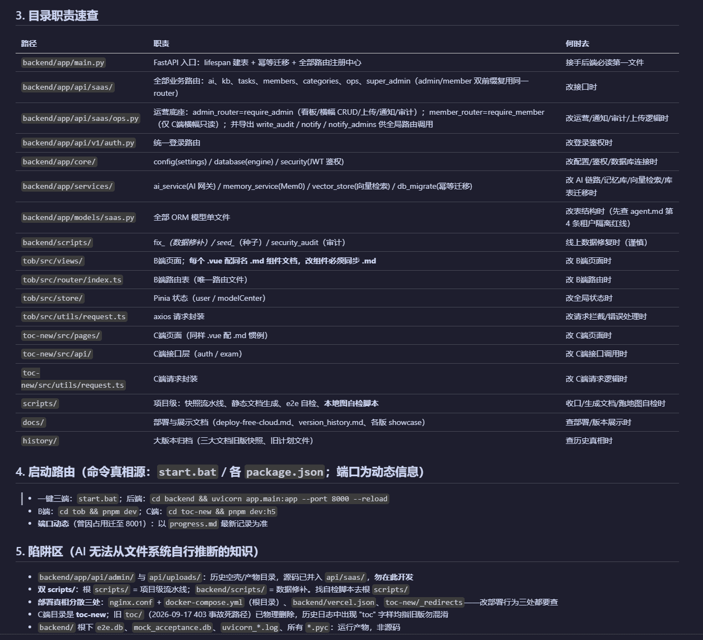

<!--
[变更日志]
修改时间：2026-09-17
AI模型：GLM (CodeBuddy)
修改内容：[v1.0：技能更名 scan-project-map → agent-project-map（GitHub 查重零撞车）；自检体系四层升级六层（+防饿死、+防语义欠账）；设计契约六条扩八条；目录树补 pre-commit.template.yaml。v1.1：自检脚本双运行时（Python 权威主版 + Node 兼容镜像，六层断言功能等价），无 Python 环境优雅降级。README 润色：新增大白话开发背景与真实产出截图（docs/ 两图）]
-->

# agent-project-map

为任意项目生成「**项目地图 + 六层断言守护**」的 AI Skill。根治 AI 辅助大项目开发中最痛的两个问题：**失忆**（上下文装不下）与**幻觉**（信息缺失后编造补位）。

## 开发背景（大白话）

这个 skill 不是一个灵感，是被坑出来的。

AI 写代码有个毛病：项目一小，它什么都记得；项目一大，它就开始失忆——不知道目录是干嘛的，找不到入口文件，改个接口要花十分钟翻文件夹。你让它多读几个文件，上下文又装不下。更糟的是幻觉：找不到信息的时候，它不问你，而是编一个出来。

第一反应是堆文档：让 AI 把项目写成维基。但这条路的终局是——**文档生成的那天就是它开始腐烂的那天**。代码天天变，文档不会，三个月后那些文档本身变成了新的幻觉源：AI 读到过时的文档，比不读还危险。

所以换了个思路：**别指望文档多，指望文档少而准，并且有东西盯着它别烂。**

- **少而准**：只写一份 ≤150 行的项目地图，只记"在哪、什么任务去哪"，绝不复制代码和配置
- **有东西盯**：一个 130 行的自检脚本，每次收口跑一遍——目录删了？红灯。地图超预算？红灯。AI 准则文件被重写导致地图没人读了？也红灯

实际效果比预期好：第一次在真实项目上跑，自检脚本当场抓出一个残留的死路径目录——就是曾经引发线上 403 事故的那个目录，早就该删但所有人都忘了它还在。

后来调研了一圈 GitHub，发现这个思路正在成为生态：AGENTS.md 把"规则"标准化了，Aider 把"结构地图"自动化了，DeepWiki 把"海量文档"工业化了。但"**人工写语义 + 机器守护结构**"这个位置，没人坐——因为人人都嫌人工维护语义贵。这个 skill 就是补这个空位的最小可行品：用粒度锁目录级 + 自检脚本 + 降级规则三个手段，把维护成本压到"半年动一次、每次五分钟"。

## 它解决什么问题

项目代码量增长到数万行后，AI 开始"失忆"：不知道目录职责、找不到入口文件、重踩历史坑。传统解法是堆海量文档——但文档本身会腐烂、会成为新的幻觉源。

本 Skill 的答案是一份**可测试的文档**：

| 能力 | 实现 |
|---|---|
| AI 秒定位 | `project-map.md`：目录职责 / 启动路由 / 部署真相 / 历史陷阱，≤150 行一次读完 |
| 漂移即红灯 | `test_project_map.py` 六层断言：清单存在性（产物区豁免）/ 准则引用存在性 / 反向扫描未登记目录（附可复制答案）/ 体积预算 / **防地图饿死** / **防语义欠账** |
| 防幻觉设计 | 结构声明以文件系统为准（机器校验），职责语义由人守护（权威分层） |
| 零维护焦虑 | 粒度锁目录级，日常改动打不穿地图；结构可再生，语义层唯一事实源是人 |

## 真实产出长什么样

> **真机项目中的截图如下**：某三端 SaaS 项目（FastAPI 后端 + Vue3 管理台 + uni-app H5），由本 skill 真实生成，非演示数据。

**图一：规模速览 + 机器可读清单**——清单块是自检脚本的唯一解析面，每行"路径 # 职责"，运行产物目录带 `# 产物区` 标注（fresh clone 不误报）：



**图二：目录职责速查 + 启动路由 + 陷阱区**——"何时去"一列让 AI 直接拿到"什么任务该进哪个目录"的判断；陷阱区收录的全是 AI 自己从代码里读不出来的知识（部署真相分散处、历史事故、易混淆目录）：



## 安装

**Claude Code：**
```bash
# 全局安装
git clone https://github.com/JasonOracle/agent-project-map.git ~/.claude/skills/agent-project-map

# 或单项目安装
git clone https://github.com/JasonOracle/agent-project-map.git .claude/skills/agent-project-map
```

**CodeBuddy / 其他兼容 Agent 工具：** 将本仓库克隆或复制到对应 skills 目录（如 `.codebuddy/skills/` 或 `agents/skills/`），只要工具会读取 `SKILL.md` 即可。

## 使用

安装后对 AI 说一句：

> 帮我生成项目地图

或任何包含触发词的话（"scan project"、"文档索引"、"AI 失忆"、"大项目幻觉"……）。AI 将执行七阶段流程：

1. **自主扫描**项目结构、启动脚本、网关配置（并探测项目的 AI 准则文件作默认值）
2. **向你提 3~5 个问题**（端构成确认 / AI 准则文件在哪 / 已知的坑 / 动态信息边界）——每问都有默认值，全部用默认也行
3. 生成 `project-map.md` + `scripts/test_project_map.py`
4. **运行自检至全绿**（首跑抓到的"未登记目录"会逐个向你求证，红灯自带可复制答案）
5. 接入项目的 AI 行为准则（AGENTS.md / CLAUDE.md / agent.md…）
6. 输出交付总结与维护规则

地图严重腐烂时的逃生舱（Phase R）：结构按新扫描重建，语义层（职责/陷阱/待确认）导出给你逐条裁决后平移，绝不静默丢弃。

**运行时自动适配**：自检脚本有 Python 版（权威主版，断言升级优先落地）与 Node 版（兼容镜像，六层断言功能等价）。安装时自动检测：有 Python 用 Python；没有则询问——可现场安装（Windows `winget install Python.Python.3` / macOS `brew install python3`），或改用 Node 版（纯前端项目天然满足，Node ≥ 14）。

## 生成后的维护规则（写给未来的 AI 和你）

- 目录**增删移**时：同步地图的 `map-paths` 清单块，顺手跑 `python scripts/test_project_map.py`（5 秒）
- **改文件内容、加页面**：不需要动地图（粒度设计使然）
- 阶段性收尾：必跑自检，**红灯禁止签署冻结时间戳**
- 大版本更迭：地图随核心文档一并归档，随新架构重写
- 任何模型想往地图塞文件树、复制配置内容、追加规划、静默重写语义层——都是在破坏设计，地图头部的八条设计契约是防线
- 可选：把 `templates/pre-commit.template.yaml` 接入 git hooks，让收口闸门从自觉升级为流水线强制

## 目录结构

```
agent-project-map/
├── SKILL.md                                 # 技能主指令（七阶段流程 + 逃生舱 + 八条设计契约）
├── templates/
│   ├── project-map.template.md              # 地图模板（占位符版，头部含八条设计契约）
│   ├── test_project_map.template.py         # 自检脚本 Python 版（权威主版，六层断言）
│   ├── test_project_map.template.js         # 自检脚本 Node 兼容版（功能等价镜像）
│   └── pre-commit.template.yaml             # 防漂移 pre-commit 片段（可选接入）
├── docs/                                    # 真实项目生成的地图截图（README 示例用）
├── README.md
└── LICENSE
```

## 设计原则（为什么这样做）

1. **卖语义不卖结构**——AI 随时能列目录，地图只卖列目录拿不到的隐性知识
2. **粒度决定腐烂速度**——锁目录级，让 90% 日常变更不触发维护义务
3. **只路由不复制**——凡有机器事实源（配置/依赖清单/SQL）的信息绝不复制进地图
4. **权威分层**——过时的地图只会降效，不会成为幻觉源
5. **可测试的文档**——`map-paths` 清单块让散文变成可断言的 manifest
6. **分层可再生**——结构可随时重推导，语义层唯一事实源是人，重写前必须导出裁决
7. **歧义标准**——机器只做无歧义记账（登记已存在的事实），凡涉删除、豁免、保留历史一律红灯上浮给人

## License

MIT
